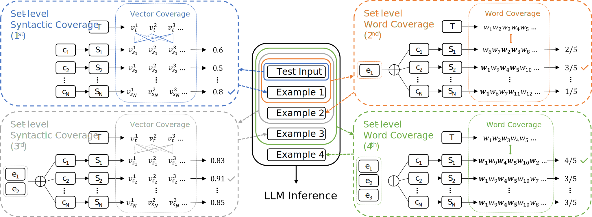

# SCOI: Syntax-augmented Coverage-based In-context Example Selection for Machine Translation

Source code of our EMNLP 2024 (Main) paper **SCOI: Syntax-augmented Coverage-based In-context Example Selection for Machine Translation**.

## Table of Contents
1. [Quick Start](#quick-start)
2. [SCOI Method](#scoi-method)
3. [Citation](#citation)

## Quick Start

### Prerequisites
```bash
pip install -r requirements.txt
python -m spacy download en_core_web_sm
python -m spacy download de_core_news_sm
python -m spacy download fr_core_news_sm
python -m spacy download ru_core_news_sm
```

### Preparation
Fetch and extract the training data. Note that test data have been provided for convenience.

```bash
cd data
sh prepare.sh
```

Prepare for in-context examples (except `BM25`, `R-BM25` and `CTQ Scorer`). Note that `BM25`, `R-BM25` and `CTQ Scorer` examples are taken from [AI4Bharat/CTQScorer](https://github.com/AI4Bharat/CTQScorer) since we use the exactly same training and test data.

```bash
cd ../src
sh prepare.sh
```

If you would like to perform the dpp method, run `sh prepare_dpps.sh` also.

### Run Experiments and Evaluation
```bash
sh run.sh
```

## SCOI Method


## Citation
If you find our work useful for your research, please cite our paper:
```
@inproceedings{tang-etal-2024-scoi,
    title = "{SCOI}: Syntax-augmented Coverage-based In-context Example Selection for Machine Translation",
    author = "Tang, Chenming  and
      Wang, Zhixiang  and
      Wu, Yunfang",
    editor = "Al-Onaizan, Yaser  and
      Bansal, Mohit  and
      Chen, Yun-Nung",
    booktitle = "Proceedings of the 2024 Conference on Empirical Methods in Natural Language Processing",
    month = nov,
    year = "2024",
    address = "Miami, Florida, USA",
    publisher = "Association for Computational Linguistics",
    url = "https://aclanthology.org/2024.emnlp-main.555/",
    doi = "10.18653/v1/2024.emnlp-main.555",
    pages = "9956--9971",
    abstract = "In-context learning (ICL) greatly improves the performance of large language models (LLMs) on various down-stream tasks, where the improvement highly depends on the quality of demonstrations. In this work, we introduce syntactic knowledge to select better in-context examples for machine translation (MT). We propose a new strategy, namely \textbf{S}yntax-augmented \textbf{CO}verage-based \textbf{I}n-context example selection (SCOI), leveraging the deep syntactic structure beyond conventional word matching. Specifically, we measure the set-level syntactic coverage by computing the coverage of polynomial terms with the help of a simplified tree-to-polynomial algorithm, and lexical coverage using word overlap. Furthermore, we devise an alternate selection approach to combine both coverage measures, taking advantage of syntactic and lexical information. We conduct experiments with two multi-lingual LLMs on six translation directions. Empirical results show that our proposed SCOI obtains the highest average COMET score among all learning-free methods, indicating that combining syntactic and lexical coverage successfully helps to select better in-context examples for MT. Our code is available at https://github.com/JamyDon/SCOI."
}
```
